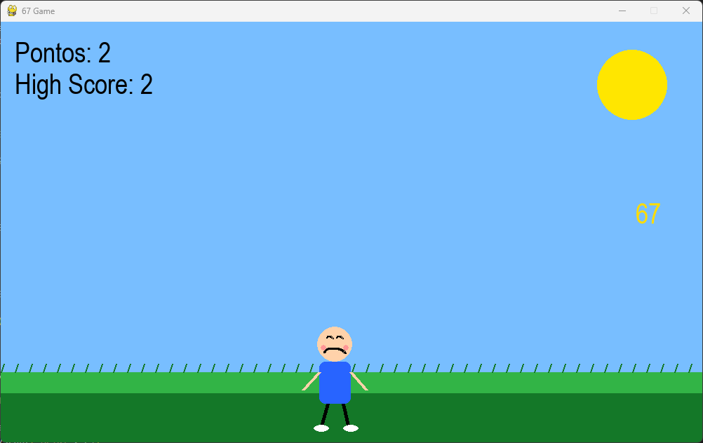

# 🎮 MENINO DO 67

<div align="center">

## 🌤️👦💛

### 🕹️ Pegue os "67" antes que eles caiam no chão!

🔥 Quanto mais pontos você faz...  
⚡ MAIS RÁPIDOS os "67" ficam!

🏆 Tente bater seu próprio recorde!

---

## 📸 Preview



</div>

---

# 🎯 Objetivo

👉 Pegue os **"67"** que caem do céu  
❌ Não deixe nenhum cair no chão  
🏆 Faça o maior número de pontos possível!

---

# 🎮 Controles

| ⌨️ Tecla | 🎯 Função |
|---|---|
| `A` / `←` | Mover para esquerda |
| `D` / `→` | Mover para direita |
| `R` | Reiniciar jogo |

---

# 🚀 Como executar

## 1️⃣ Instale o Python

🌐 https://www.python.org/downloads/

---

## 2️⃣ Instale o Pygame

```bash
pip install pygame
```

---

## 3️⃣ Execute o jogo

```bash
python jogo67.py
```

---

# ⚡ Sistema de dificuldade

A cada **10 pontos**:

- ⚡ Os "67" ficam mais rápidos
- 🔥 O jogo fica mais difícil
- 🏆 Seu reflexo é testado

---

# 🏆 Funcionalidades

- ✅ High Score
- ✅ Reinício rápido
- ✅ Velocidade progressiva
- ✅ Campo animado
- ✅ Gameplay divertida
- ✅ Feito totalmente em Python

---

# 🐍 Tecnologias usadas

- Python
- Pygame

---

# 📁 Estrutura do projeto

```bash
📦 menino-do-67
 ┣ 📜 jogo67.py
 ┣ 📜 README.md
 ┗ 🖼️ preview.png
```

---

# 🌟 Dica

💡 Tente prever onde o próximo **67** vai cair!

---

<div align="center">

# 👑 Autor

Feito por **Samir** 🚀🔥

</div>
